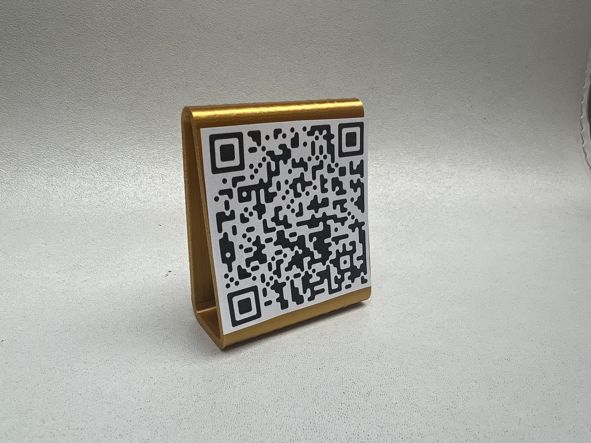
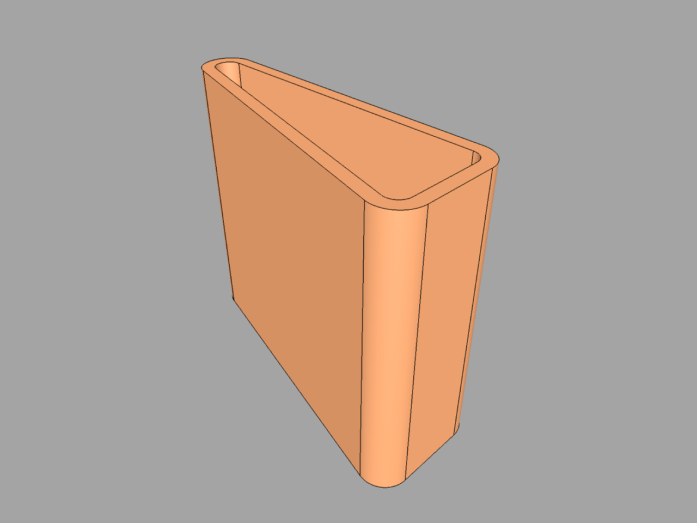
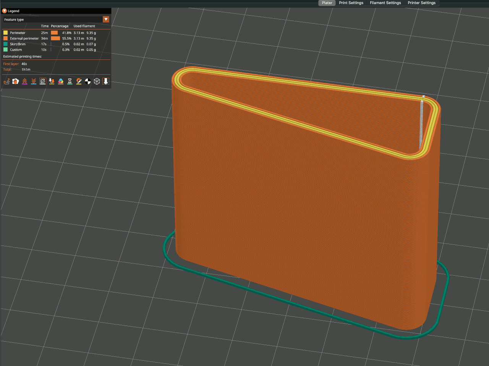

# Wi-Fi QR code stand

Why waste time with wordy passwords? This compact stand can show guests a QR code to join your Wi-Fi network!

Crafted with care, this 3D printed Wi-Fi QR code stand is small, easy to print, and highly functional.

Use <https://sharesnip.rosano.ca/generate> to generate a Wi-Fi QR code and print it out scaled to 5 cm x 5 cm on a 2D printer.

It has splendidly smooth, rounded corners:

The model is designed to print easily without supports. Be sure to set the seam position to the rear, out of sight. It's carefully designed to be printed with a 0.4 mm (or 0.6 mm) nozzle and a 0.2 mm layer height. PrusaSlicer slices the walls into a sturdy four-line wall:

Download this delightful design today and make it easy for guests to join your network!

<https://www.printables.com/model/474712-wi-fi-qr-code-stand>

## License

CC0

## Author

Leon Brocard <acme@astray.com>
